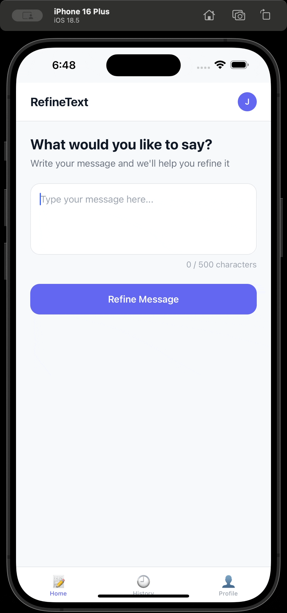

# RefineText AI 

> **Say it better, every time.**

A cross-platform mobile application that uses AI to help users refine and personalize their written communication across various life scenarios - from business emails to romantic messages.

[](https://reactnative.dev/)
[](https://firebase.google.com/)
[](https://openai.com/)

---

## Demo
| Feature 1 | Feature 2 |
|:---------:|:---------:|
|  |  |
| Login & Authentication | AI Message Refinement |

---

## Problem Statement

In today's digital age, effective communication is crucial across multiple contexts - professional, personal, and social. However, many people struggle with:

- **Tone adjustment**: Striking the right balance between professional and friendly
- **Context switching**: Adapting language for different audiences (boss, partner, clients)
- **Time constraints**: Crafting well-written messages quickly
- **Confidence**: Uncertainty about how messages will be received

**RefineText AI** solves this by providing instant, AI-powered message refinement tailored to specific contexts and desired tones.

---

## Key Features

### Core Functionality
- **AI-Powered Refinement**: Leverages OpenAI's ChatGPT API to intelligently rewrite messages
-  **Multiple Categories**: Business, Romantic, Workplace, and Parenting contexts
-  **Tone Customization**: Polite, Funny, Warm, Direct, and more
-  **Multiple Versions**: Generate 3 variations of each message
-  **Edit & Copy**: Fine-tune AI suggestions before using them
-  **Message History**: Save and revisit past refined messages

### User Experience
-  **Secure Authentication**: Email and Google Sign-In via Firebase
-  **Cross-Platform**: Built with React Native for iOS and Android
-  **Modern UI/UX**: Clean, intuitive interface with smooth animations
-  **Freemium Model**: Free tier with upgrade path to premium

---

## Tech Stack

| Category | Technology |
|----------|-----------|
| **Frontend** | React Native (Expo) |
| **Backend** | Firebase (Firestore + Authentication) |
| **AI Integration** | OpenAI ChatGPT API |
| **Navigation** | React Navigation |
| **Payments** | Stripe SDK (future integration) |
| **State Management** | React Hooks (useState, useContext) |

---

## Architecture & User Flow

<div align="center">
  
  
</div>


## Getting Started

### Prerequisites

- Node.js (v16+)
- npm or yarn
- Expo CLI (`npm install -g expo-cli`)
- Firebase account
- OpenAI API key

### Installation

1. **Clone the repository**
   ```bash
   git clone https://github.com/yourusername/refinetext-ai.git
   cd refinetext-ai
   ```

2. **Install dependencies**
   ```bash
   npm install
   # or
   yarn install
   ```

3. **Set up environment variables**
   
   Create a `.env` file in the root directory:
   ```env
   OPENAI_API_KEY=your_openai_api_key
   FB_API_KEY=your_firebase_api_key
   FB_AUTH_DOMAIN=your_firebase_auth_domain
   FB_PROJECT_ID=your_firebase_project_id
   FB_STORAGE_BUCKET=your_firebase_storage_bucket
   FB_MESSAGING_SENDER_ID=your_firebase_messaging_sender_id
   FB_APP_ID=your_firebase_app_id
   ```

4. **Run the app**
   ```bash
   expo start
   ```

5. **Test on device**
   - Scan the QR code with Expo Go app (iOS/Android)
   - Or press `i` for iOS simulator, `a` for Android emulator

---
</div>
